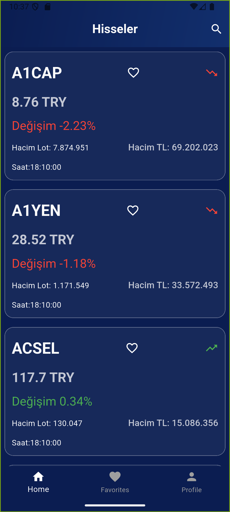
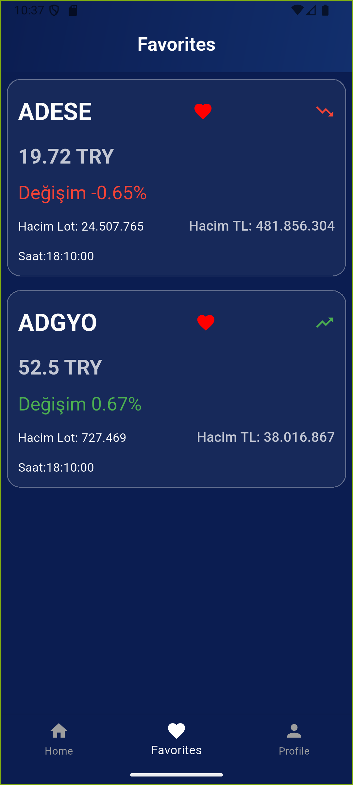
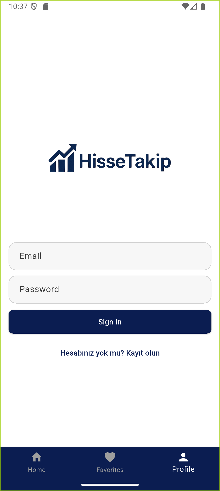
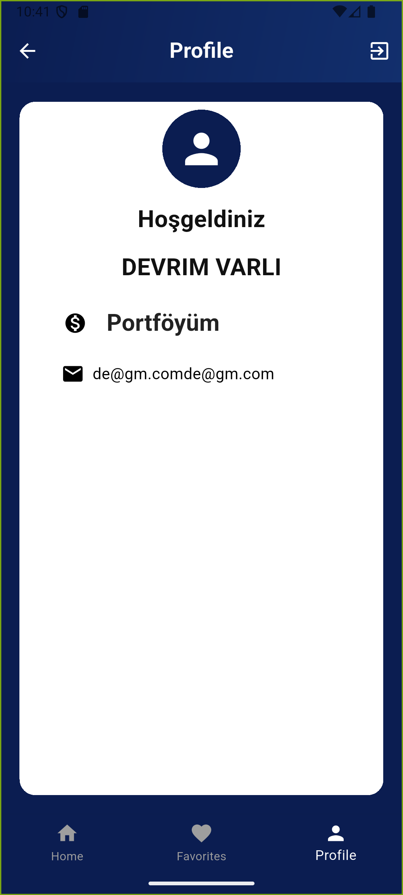
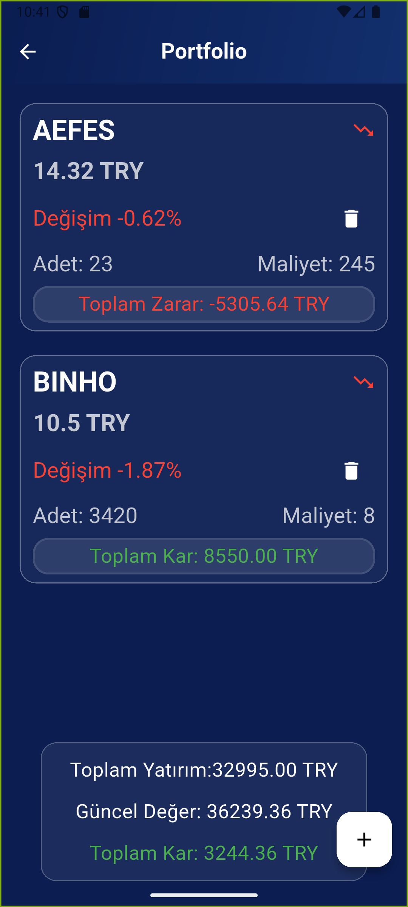

# 📊 Borsa Uygulaması

Flutter ile geliştirilmiş modern borsa takip uygulaması.  
Firebase, Riverpod, Hive, Dio ve Freezed gibi güçlü teknolojiler kullanılarak tasarlanmıştır.  

---

## 🚀 Özellikler
- 🔐 **Firebase Authentication** ile güvenli kullanıcı girişi  
- ☁️ **Cloud Firestore** entegrasyonu (gerçek zamanlı veriler)  
- 📦 **Hive** local database ile cache & offline destek  
- 🌐 **Dio** ile hızlı ve güvenilir API entegrasyonu  
- 🧩 **Riverpod** state management  
- 🛠️ **Freezed & Json Serializable** ile otomatik model üretimi  
- 🎨 **FlexColorScheme** ile özelleştirilmiş tema desteği  
- 🌍 **easy_localization** ile çoklu dil desteği  
- ✨ **animate_do** ile modern animasyonlar  
- 🔽 **dropdown_search** ile gelişmiş arama & seçim alanları  

---

## 📸 Ekran Görüntüleri
> Buraya proje ekran görüntülerini ekle (ör. `assets/screenshots/`)  

| Anasayfa | Favoriler | Login | Profil | Portföy |
|----------|-----------|-------|--------|---------|
|  |  |  |  |  |


---

## 🛠️ Kullanılan Teknolojiler

- **Flutter SDK**: ^3.9.0  
- **Firebase**: firebase_core, firebase_auth, cloud_firestore  
- **State Management**: riverpod, flutter_riverpod, riverpod_annotation, riverpod_generator  
- **Local Database**: hive_ce, hive_ce_flutter, hive_ce_generator  
- **Networking**: dio  
- **Model & Code Generation**: freezed, json_serializable, build_runner  
- **UI & Animasyon**: flex_color_scheme, animate_do, dropdown_search  
- **Çoklu Dil**: easy_localization  

---

## 📦 Kurulum

1. Bu projeyi klonla:
   ```bash
   git clone https://github.com/<kullaniciadi>/borsa_app.git
   cd borsa_app
